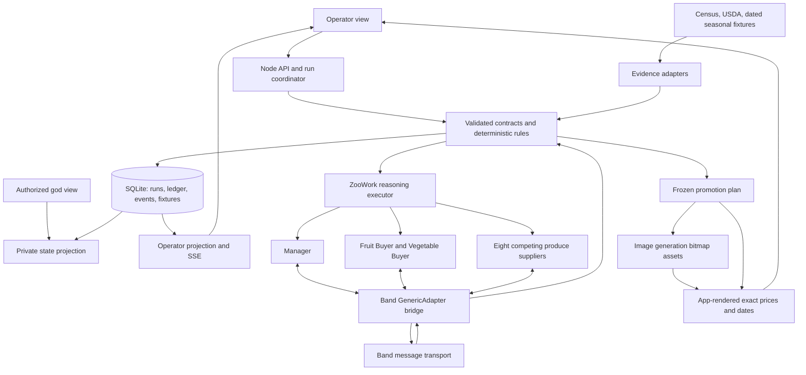

# Produce purchasing agents — hackathon plan

## Status and deadline

- **Status:** implemented and verified through an actual eleven-role ZooWork + Band purchasing run. All 24 decisions and eight suppliers passed; the same real run also passed operator approval, generated-art flyer composition, god-view privacy, reload, and mobile browser checks. No real orders or payments occur.
- **Demo deadline:** Saturday, October 3, 2026, **4:00 p.m. America/Los_Angeles (PDT)**.
- **Delivery target:** a local, end-to-end demo that turns store context into produce purchasing decisions, negotiates with simulated suppliers, explains outcomes, and produces a promotional flyer.
- **Operating boundary:** all purchasing is simulated. No real supplier orders or payments.
- **Working demo store:** a fictional grocery store in San Francisco, real Census ZCTA **94110**. Sales, inventory, inbound shipments, expiry, and supplier constraints are explicitly simulated.
- **Repository baseline:** began as README-only; now contains the running application, shared contracts, persistent backend, source adapters, generated artwork, and verification tests.
- **Integration status:** all eleven independent Band identities authenticated and connected; fourteen required pair roundtrips passed. The actual purchasing run completed in **146.615 seconds** with 23 successful ZooWork reasoning calls across all eleven roles, 82 real Band messages sent/received/processed, 24 decisions, eight supplier responders, 23 accepted simulated purchases with confirmed receipts, one budget walkaway, and zero technical/provider failures. The independent ledger/stock/privacy audit passed with **$974.72 committed** and no remaining reservations. Credentials remain server-side and absent from this document/client code/logs.

Production demo: http://127.0.0.1:3001. Development preview: http://127.0.0.1:5173. See `README.md` for launch/reset, the exact credential slots, readiness refresh, verification commands, and the distinction between simulation and actual-provider checks. This remains the iteration and acceptance document; no real purchases occur.

The later user-requested social feature passed a second actual browser-driven end-to-end purchasing run: fresh Glasser TikTok + X results (16 linked records), explicit opt-in after the exact case preview, all 24 decisions/eight suppliers, 23 confirmed receipts, and **$997.95 committed** with no reservations or technical failures. Actual cucumber acceptance was 72 units, matching the 36→72 preview. Independent ledger/stock/floor/privacy and frozen-evidence audits passed; the same browser run approved its exact-price flyer and passed reload/mobile/god checks with zero JavaScript or console errors. The previous completed live run was unchanged. ZooWork completed 23 calls across all eleven roles and Band delivered/processed 82 messages without errors.

## Demo story and scope

The operator chooses the demo store and a weekly purchasing budget, reviews the evidence and proposed needs, then starts a purchasing run. The MVP focuses exclusively on the **produce department**. A manager coordinates a Fruit Buyer, a Vegetable Buyer, and **eight competing simulated produce suppliers**. Eight suppliers and 24 SKUs are the concrete planning assumptions for the requested broader supplier network and assortment. Buyers exchange offers and counteroffers, escalating a request when their allocated budget is insufficient. The manager can approve a justified reallocation or decide that an item cannot be sourced this week.

The demo contains **eleven runtime agent roles**, **24 produce SKUs**, and three deliberately exercised outcomes:

1. An acceptable quote lands within the buyer's original allocation.
2. A buyer requests more budget, the manager evaluates it, and the resulting decision is recorded.
3. No eligible supplier can satisfy the budget and availability/quality constraints, so the buyer walks away this week.

The user view explains purchases, omissions, evidence, budget use, and promotions. A separate god view shows supplier objectives and hidden constraints alongside the same negotiation timeline. The run concludes with one produce loss leader, two complementary produce products, and a generated flyer based on a frozen promotion plan.

The fixture catalog has **12 fruit SKUs and 12 vegetable SKUs**, assigned as follows. These are merchandising categories, not botanical classifications; avocados belong to the Fruit Buyer in this expanded catalog.

| Buyer | Assigned produce SKUs |
|---|---|
| Fruit Buyer | Apples, bananas, strawberries, blueberries, raspberries, grapes, oranges, mandarins, lemons, limes, pears, avocados |
| Vegetable Buyer | Tomatoes, romaine lettuce, broccoli, potatoes, onions, carrots, cucumbers, bell peppers, zucchini, spinach, kale, mushrooms |

Freeze grade, organic/conventional specification, pack size, opening inventory, forecast demand, expiry, and delivery requirements with the shared schemas. Give the fixture scenario an explicit date and label simulated values throughout the interface.

All eight suppliers participate in actual agent exchanges and have overlapping eligible catalogs. Fixture validation must prove at least three compatible supplier options per SKU and at least one eligible line for every supplier. Runtime shortfalls must be explained and distinguished from the successful-rehearsal target. Every one of the 24 SKUs receives an inventory recommendation, supplier evaluation, and resolved purchasing decision. Show three spotlight SKU decisions—a competitive win, a budget escalation, and a walkaway—as the presentation narrative; the other 21 still complete the same validated decision process. Batch RFQ and negotiation lines by buyer–supplier pair rather than running every supplier–SKU combination through separate multi-round calls.

## Architecture and integration responsibilities

Implemented with **Node.js 24.21.0, TypeScript, React/Vite, a Node server, and built-in SQLite**; the documented minimum is Node 22.13. Run the server as a persistent process. Keep schemas and event definitions shared between the server and UI. Use a small number of modules and one database; avoid a separate distributed task platform for this deadline.

**ZooWork centrally executes agent reasoning** for the manager, buyers, and suppliers. **Band carries actual inter-agent messages** through a `GenericAdapter` bridge. The backend owns the complete state machine, action validation, transitions, scheduler, and durable business state. Integration adapters expose `reason(role, context)`, `send(envelope)`, `onMessage(callback)`, and provider lifecycle methods; they do not implement a second negotiation loop. Neither model output nor transport delivery can directly mutate budgets or finalize purchases without validation.

### ZooWork adapter

Use the TypeScript SDK to submit role-specific reasoning with bounded context and parse validated structured results. Probe the documented custom-tools/deployment path first. If that path cannot be demonstrated quickly, keep ZooWork central by requesting structured JSON decisions and executing the validated actions in the backend. This fallback changes the action execution mechanism; it does not replace ZooWork reasoning.

Map each runtime role to a separate ZooWork agent resource and give each run fresh role-specific conversation context. An `actor.ref` label is not an isolation boundary. Only assemble the context permitted for that role; supplier private state must not enter buyer/manager contexts.

The startup gate must verify model selection → agent start/ready → a schema-valid action, then measure a realistic 12-line batch, not only a toy response. Track request IDs, duration, errors, and source mode without storing credentials. Break the response stream when `run.finished` arrives rather than waiting indefinitely. Closing a stream does not prove provider execution or billing stopped: test an explicit interrupt operation if supported; otherwise fence local results and mark external execution status unknown. ZooWork authentication, ready lifecycle, strict JSON actions, a representative 12-line batch (10.071 seconds), and all eleven role resources passed actual-provider verification. Custom tools were not used or verified; validated JSON actions execute in the backend.

### Band adapter

Build a `GenericAdapter` bridge that translates our typed messages into Band messages and maps received messages back into validated domain actions. Attach run IDs, batch IDs, RFQ line/intent IDs, quote and quote-line IDs where applicable, message IDs, correlation IDs, Band room IDs, sender/recipient roles, and message type. Use a separate buyer–supplier room for each pair so that competing suppliers do not receive each other's private conversations. Manager–buyer escalation uses separate role-scoped conversations. Maintain independent persistent transport sessions for all eleven identities; reuse pair-specific rooms across SKU batches within a run. Deduplicate delivery and persist the negotiation events needed to recover the view after reload.

Band's documented agent credential cannot create agents: registration is an Enterprise Human API operation, and that API rejects agent keys with HTTP 403. Provision ten additional identities in the [Band app](https://app.band.ai/) through Agents → New Agent → Remote Agent (called External in SDK instructions): **Fruit Buyer, Vegetable Buyer, Regional Wholesaler, Local Farm, Organic Distributor, Surplus Distributor, Fruit Specialist, Vegetable Grower Co-op, Import Distributor, and Rapid Delivery Supplier**. Keep the existing identity as manager. One additional identity is enough for the first bidirectional smoke test; all eleven are needed for the full demo. Sharing a single credential does not create independent identities, and agents cannot mention themselves. Completed in this workspace: all ten additional identities were supplied and all eleven connected. The manager provisions private rooms and invites the known buyer/supplier identities; each participant sends using its own credentials. Buyer registry access remains private. Fresh installations still require these setup steps.

Band's published account limits conflict: the [pricing page](https://www.band.ai/pricing) lists 20 remote agents for Free, while the reviewed hacker guide lists 10. Effective access for eleven identities was **verified in this account** by simultaneous connections and the successful actual run. No account upgrade was needed; fresh installations should still check their own effective quota.

The live gate must prove a real ZooWork reasoning result and a real Band send/receive exchange, with the two connected before claiming the integration works. Validate the authenticated Band sender and the server-maintained room/role mapping; ignore claimed actor/role fields as authorization evidence.

Use a minimal transactional inbox/outbox in SQLite: deduplicate and durably enqueue inbound messages, commit business changes with their events and outgoing message intents, then deliver and mark outgoing acknowledgments with bounded retries. Live purchase acceptance notices are persisted in the purchase transaction; a typed, identity-matched supplier receipt marks confirmation. One bounded receipt wait is used; missing acknowledgment remains explicitly unconfirmed without reversing the ledger. A transport callback returns after durable enqueue; transport receipt acknowledgment follows that durable receipt when controllable, and application completion acknowledgment follows committed handling. Do not await a peer reply inside an inbound callback or hold a provider execution permit while waiting for transport. Negotiation limits and execution permits are separate, so waiting conversations cannot block the suppliers needed to answer them.

### Runtime roles

| Role | Responsibility | Permitted context |
|---|---|---|
| Manager | Prioritize demand, allocate funds, evaluate escalation, finalize sourcing decisions | Store evidence, public quotes, buyer requests, budget ledger; no supplier floors or desired prices |
| Fruit Buyer | Evaluate and resolve all 12 assigned fruit SKUs; batch supplier comparisons and negotiations; request bounded budget increases | Its purchase intents, reservation, public supplier quotes and messages |
| Vegetable Buyer | Evaluate and resolve all 12 assigned vegetable SKUs under the same comparison and batching rules | Its purchase intents, reservation, public supplier quotes and messages |
| Regional Wholesaler | Broadline produce coverage with competitive bulk pricing and case/minimum-order constraints | Its own floor, desired price, stock, strategy, and its buyer conversations |
| Local Farm | Offer seasonal freshness with limited stock | Its own floor, desired price, stock, strategy, and its buyer conversations |
| Organic Distributor | Offer premium organic specifications at higher prices | Its own floor, desired price, stock, strategy, and its buyer conversations |
| Surplus Distributor | Offer discounted ripe produce with shorter remaining shelf life | Its own floor, desired price, stock, strategy, and its buyer conversations |
| Fruit Specialist | Offer deep fruit coverage, differentiated grades, and fruit-specific availability | Its own floor, desired price, stock, strategy, and its buyer conversations |
| Vegetable Grower Co-op | Offer broad vegetable coverage with harvest-linked stock and case quantities | Its own floor, desired price, stock, strategy, and its buyer conversations |
| Import Distributor | Specialize in imported tropical fruit and citrus, with lead-time and shipment-size constraints | Its own floor, desired price, stock, strategy, and its buyer conversations |
| Rapid Delivery Supplier | Offer broad produce coverage and short delivery windows at a service premium | Its own floor, desired price, stock, strategy, and its buyer conversations |

All eight supplier personas are fictional simulations, not verified vendors. Regional Wholesaler and Rapid Delivery Supplier provide broad overlapping coverage; Fruit Specialist and Vegetable Grower Co-op add a third option across their respective categories. Local Farm, Organic Distributor, Surplus Distributor, and Import Distributor have narrower, overlapping catalogs with at least one eligible quoted line each. Assert three compatible options for every fixture SKU. Include at least one explicitly organic SKU with matching organic offers from three suppliers, including Organic Distributor, so its participation does not depend on treating conventional and organic goods as equivalent. Record runtime insufficient coverage or provider failures separately. All eight suppliers must respond to relevant RFQs in the demo, not merely appear as cards. Organic/conventional status and grade are distinct specifications. Alternatives require an explicit allowed substitution rather than an assumed equivalent comparison.

Supplier agents may reason about concessions, but deterministic server rules enforce their minimum prices and remaining stock. The backend cannot grant a buyer knowledge of a supplier's hidden constraints simply because it hosts both agents.

## Shared contracts to freeze first

Use runtime-validated schemas as the authoritative contract. Shared identifiers are opaque strings. Monetary totals and ledger balances are integer **USD cents**. A quoted case/line total is authoritative; derived unit rates may be exact rational values rather than whole cents. Use fixed-count or fixed-weight packs only, with integer base quantities (for example grams), explicit conversion factors, and no binary floating-point money calculations. Calculate from exact rates and round half-up to cents once at the final line total; never round a per-pound comparison rate and multiply it back into the order. Unknown case weights or unsupported unit conversions are invalid offers. Use ISO timestamps, explicit business time zones, immutable quote revisions, and versioned run/intent state.

| Contract | Required fields and semantics |
|---|---|
| `RunConfig` | Run ID and generation/version; store ID; ZCTA; scenario date; buying window; total purchase budget cents; separate promotional loss allowance cents; scenario/fixture ID; live/replay mode; eleven-role mapping; configurable provider/exchange concurrency and deadlines |
| `InventoryItem` | SKU ID; buyer category; specification/grade/organic status; sale/base unit; fixed pack count or weight; forecast by dated bucket; safety stock; lots with quantity, on-hand/inbound status, availability date, expiry, committed quantity, and landed cost basis; retail price cents; provenance |
| `Evidence` | Evidence ID; source URL/name; `fetchedAt`, `observedAt`/period, and `scenarioDate`; geography; commodity/product mapping; units/pack/grade/market where relevant; value or summary; confidence and limitations; live/cached-live/fixture/derived provenance |
| `PurchaseIntent` | Intent ID and revision; run ID/generation; buyer role; SKU; quantity and case count; delivery window; target cost cents; allocated maximum spend cents; reservation ID; rationale; evidence IDs; substitution policy |
| `RFQ` | Batch/RFQ ID; run/buyer/supplier IDs; Band room and correlation IDs; response deadline; lines with stable line ID, intent ID, SKU/specification, requested quantity, pack basis, delivery window, minimum remaining shelf life, and comparison criteria; eligible supplier mapping per line |
| `Quote` | Quote/batch ID and immutable revision; RFQ/run/supplier IDs; Band room and correlation IDs; independently selectable line offers with quote-line/RFQ-line/intent IDs, matched SKU/specification/grade, organic status, offered quantity/public availability, units per case, minimum order, price basis, authoritative case price cents or exact rational rate, fixed base-unit quantity, allocated freight/charges, final landed cost cents, delivery date, remaining shelf life, expiry, status, and inventory reservation ID if held |
| `BudgetRequest` | Request ID; intent/buyer IDs; existing reservation; requested increment cents; candidate quote and quote-line IDs; rationale; response status and decision ID; idempotency key |
| `Decision` | Decision ID; run/intent IDs and expected revisions; outcome; chosen supplier and selected quote-line or no-purchase reason (no replenishment needed, budget priority, unavailable, or failed); alternative quote-line IDs and rejection reasons; comparison rationale; committed cost cents; quantity; evidence IDs; explanation; approval status if applicable; idempotency key |
| `SupplierPrivateState` | Supplier ID; SKU; minimum acceptable price; desired price; actual remaining stock and active stock reservations; private urgency; concession policy; negotiation state; private reasoning summary if retained; **private visibility only** |
| `Promotion` | Promotion/plan IDs and revision; approved SKU/decision IDs; exact retail price cents; unit basis; eligible lot IDs; quantity cap; effective dates; landed cost basis; loss allowance and exact exposure calculation; complementary-product links; frozen status |
| `RunEvent` | Event ID; monotonic per-run sequence; run ID; actor role; event type; timestamp; batch/RFQ-line/quote-line/message/correlation IDs and Band room ID where applicable; typed payload; visibility; provenance; schema version |

Suggested message types: `purchase_request`, `quote_request`, `quote`, `counteroffer`, `budget_request`, `budget_decision`, `accept_quote`, `purchase_unavailable`, and `agent_error`. Freeze their payload schemas before the UI and integration work diverge. Batches group transport and reasoning requests; budgets, stock holds, round limits, and idempotent acceptance remain per line. For the MVP, each quoted line is independently selectable and includes its allocated delivery cost; do not silently assume cross-line discounts or order-wide minimums. Validate returned batches line by line: quarantine unknown or duplicated IDs, preserve independently valid lines, and permit one bounded repair request for invalid lines. Never discard a whole valid batch because one line failed, or silently attach an unknown line to another intent. Public offered availability is distinct from the supplier's full private inventory and reservations; expose only the stock a supplier chooses to offer and the accepted quantity.

### API and views

| Route | Purpose |
|---|---|
| `POST /api/runs` | Validate configuration and start an idempotent run |
| `GET /api/runs/:runId` | Operator-safe snapshot including decisions, evidence, and budget totals |
| `GET /api/runs/:runId/events` | Operator-safe SSE stream with sequence-based resume |
| `GET /api/runs/:runId/god` | Server-authorized private projection and supplier objectives |
| `GET /api/runs/:runId/god/events` | Server-authorized private event stream |
| `POST /api/runs/:runId/cancel` | Fence further actions, mark cancelled, release uncommitted holds, and attempt verified provider interruption |
| `POST /api/runs/:runId/approve` | Idempotently record an operator approval where configured; validate decision type and current state |
| `POST /api/runs/:runId/flyer` | Generate assets from an approved, frozen promotion-plan revision |
| `GET /api/runs/:runId/flyer` | Retrieve flyer status, assets, and the exact promotion-plan revision used |

Default manager budget reallocations run autonomously within the original authorized purchasing budget. An operator approval endpoint must not silently expand that total; any explicit change to the run budget needs separate validated semantics. Require one operator click to approve the final promotion plan. Snapshots include an event-sequence watermark read consistently with state, so SSE resumes without a snapshot/subscription gap.

The server must select an allowed projection **before serialization**. Supplier private fields, context, labels identifying minimum/target prices, and private reasoning must be absent from operator responses/events and buyer/manager prompts. Supplier models return private reasoning separately from allowlisted typed public offers/actions; render public dialogue from templates over validated public fields, never raw supplier prose or private-context error logs. A legitimate public offer may numerically equal a private floor; numeric coincidence is not a disclosure. Bind action authorization to authenticated Band sender/room mappings. God mode requires server-checked authorization; freeze the local-demo mechanism at implementation start.

## Purchasing rules and bounded negotiation

Start with a transparent demand calculation:

`net units needed = max(0, forecast demand + safety stock - usable on-hand units - confirmed inbound units)`

Calculate usable quantities from dated lots: count inbound only when it arrives within the relevant demand bucket and exclude stock that expires before its planned sale. Round up to complete cases, then apply case/order limits, shelf-life limits, supplier availability, and the available budget. Forecast demand is seeded for the demo. Any seasonal or contextual adjustment must be recorded with its rationale and bounded so that it cannot create an unexplained order spike.

Each buyer sends initial **batched RFQs to every eligible supplier for its assigned catalog**; the combined initial fanout reaches all eight suppliers. Collect **at least three eligible comparable quotes per SKU when available**, recording insufficient options with a reason. Shortlist **at most two suppliers per SKU** for counteroffers, and batch those lines by buyer–supplier pair. Every SKU receives full evaluation. Settle most lines on the best valid initial offer or a justified no-replenishment decision; concentrate counteroffers on the three spotlight cases and any material remaining exception. All supplier requests and replies use real Band exchanges. Compare matched SKU/specification and normalized packs, landed cost, quality, offered availability, remaining shelf life, delivery timing, and minimum-order quantity. Eliminate infeasible offers first; record why the selected feasible offer provides better value. The lowest nominal price need not win when spoilage risk, quality, or delivery makes it unsuitable.

The manager owns the budget ledger. Reserve category/intent budgets atomically before parallel buyers negotiate. Buyers cannot raise their own caps. Keep a positive manager reserve in the fixture so the intended escalation can succeed. A budget escalation draws from uncommitted manager funds or an explicitly released reservation, never from funds already committed elsewhere. Maintain `total budget = committed + active reservations + unallocated` in every state, including researching, cancellation, and failure.

Supplier stock is shared across every negotiation with that supplier. Create or release any stock hold atomically, with an expiry, so parallel buyer conversations cannot reserve the same units twice. Quote acceptance performs one atomic transaction: validate quote validity, available stock net of other holds, its own valid stock hold if present, price floor, buyer budget reservation, run state, and duplicate acceptance; commit the landed purchase cost; consume the stock hold or atomically allocate unheld stock; decrement simulated supplier stock; record the decision and event. Release unused budget reservations and stock holds on completion, rejection, expiry, or abandonment. An idempotency key prevents replay of the same request. Additionally, enforce a unique committed decision for `(run_id, intent_id)` and a compare-and-swap from the expected open intent/run revision to committed inside this transaction. This rejects two different quote IDs racing to purchase the same intent, stale quote revisions, and acceptance racing with cancellation or reservation release. Check action ownership, quantity/specification, delivery, expiry, and all cost calculations again at commit.

Bound each buyer–SKU sourcing decision to **at most three counteroffer rounds shared across its shortlisted suppliers and one budget escalation**, followed by accept, approved substitution, or unavailable. A round sends one counteroffer line to one shortlisted supplier, potentially within a larger batch; the limit is not reset for each supplier. Use a configurable global limit of **four concurrent supplier exchanges** initially, with a separate cap of four in-flight reasoning/provider calls. Batch lines across the catalog; do not impose a two-SKU evaluation bottleneck. Reuse independent supplier sessions and schedule batches fairly between buyers. Add deadlines and bounded retries to each call and a run deadline that resolves pending lines with explicit timeout/failure reasons. Measure startup and batch latency at the live gate before setting deadlines. Target a measured full eleven-role/24-SKU purchasing run of five minutes or less before 3:15 p.m.; the actual ZooWork + Band purchasing run passed in 146.615 seconds with all 24 decisions, after the earlier test-transport rehearsal. If it misses, reduce unnecessary counteroffers/context and batch more effectively while retaining every supplier and SKU. Partial quantities and split sourcing are outside the MVP; select one supplier per accepted decision. A failed SKU becomes an explained result without preventing other SKUs from finishing.

Run progression: `created → researching → allocating → negotiating → reviewing → flyer_ready → complete`, with terminal `cancelled`, `failed`, and `interrupted` states. Every mutation checks run generation/version and allowed state. Cancellation or failure fences late callbacks and atomically releases uncommitted budget/stock holds; existing commitments remain recorded. Keep technical failures separate from legitimate business walkaways.

After process restart, mark unfinished runs interrupted, retain committed decisions and events, release uncommitted holds, and start a fresh run for the demo; automatic durable agent resumption is outside scope. Dispatch pending outbox actions only for an active matching generation. Replay is a read-only projection of recorded events: no provider calls, order actions, or ledger mutations. Label recorded and synthetic fixtures distinctly; replay does not satisfy live integration acceptance.

## Evidence and merchandising

### Neighborhood context

Use one Census 2020 P9 profile for ZCTA 94110, with the observation year and geography clearly shown. Implementation finding: the direct API requires a key; a verified national-archive record is shipped as a cached official fallback, joined by geography/log-record identifier (68,336 total residents, including 22,160 Hispanic or Latino). A ZCTA is a statistical geography and should not be presented as an exact store catchment or equivalent to every postal ZIP boundary. Census demographics are a weak hypothesis about potential assortment relevance, not a deterministic ethnic purchasing rule. Combine them with store sales, explicit operator preferences, inventory, and seasonal context. Avoid claims that a demographic group necessarily purchases a specific product.

### USDA market observations

Implementation finding: the San Francisco terminal fruit and vegetable series were discontinued in May 2025. Use the current Los Angeles terminal fruit report (2306) as an explicitly labeled geographic proxy for the San Francisco store; never present it as a current Bay Area quote. Implemented matched current/history AMS produce observations for **five catalog commodities**: bananas, blueberries, apples, grapes, and strawberries; coverage is not claimed for all 24. Preserve missing coverage for other products; never invent a live observation or substitute an incompatible commodity. Retrieve this narrow set of observations and preserve the market, report date, commodity, grade, package, units, and geography needed to interpret them. Compare only observations with compatible definitions. Missing or incompatible data should yield an unavailable/low-confidence signal rather than a fabricated price movement.

AMS observations provide market context; they are not binding supplier quotes or proof of a future price rise. An earlier purchase suggestion must explain uncertainty and inventory/storage constraints. Authentication, report discovery, coverage for the chosen SKUs, and response normalization need a bounded live probe. Preserve observation date, fetch time, and scenario date independently, with live/cached-live/fixture labels; a cached live observation does not become current because it was fetched today.

### Seasonality, inventory, and promotions

Implemented a simulated October 4–5 fall produce weekend: +10% apple forecast, rounded up and capped at four units before net-need and whole-case rounding. Baseline 44→48 forecast gives 44 net units and two 40-unit cases; this is an assumption, not a discovered event or measured lift. Other SKUs retain baseline forecasts. Seed sales, on-hand inventory, inbound stock, expiry, and existing retail prices, with labels that distinguish these from live sources. Discount recommendations depend on inventory and expiry evidence, not wholesale price changes alone.

Select **one produce loss leader and two complementary produce products** from the 24-SKU catalog after sourcing. Keep promotional loss separate from the procurement budget. Every promotion freezes exact price, quantity cap, effective dates, eligible lots, and landed cost basis. Compute loss exposure as `sum(max(0, landed unit cost - retail unit price) × quantity cap)`, using exact quantity/rate arithmetic and the documented final-total rounding. Do not offset loss with hoped-for profits on complementary items. Total exposure must fit the promotional allowance.

Promotion inventory must arrive by the promotion start and remain usable through its planned sale window, net of prior commitments. Validate this from lot dates rather than total purchased quantity. Seed fixtures that mathematically support all three negotiation outcomes and three available promotion products; supplier floors, case sizes, manager reserve, delivery/expiry dates, and promotion loss limits must make those outcomes possible.

## Flyer generation

Completed: built-in image generation produced saved overview artwork and a banana/apple/carrot flyer asset. The app uses pregenerated artwork with exact approved product names, prices, dates, and quantity caps rendered separately. Dynamic in-app image generation remains deferred; saved artwork is not labeled live generation.

Freeze an operator-approved promotion-plan revision before composing the final flyer. Render product names, exact prices, quantities, dates, and fine print in the application over generated bitmap artwork. The preview records the plan revision and asset provenance. An unavailable fresh-generation path must not prevent composition with a saved approved asset or be presented as a fresh generation success.

Defer dynamic image regeneration, PDF export, hosted deployment, elaborate graphs, and advanced filter controls until after the core demo. The required result is a usable produce flyer preview with correct approved offers.

## Two interfaces

### Operator view

- Store/scenario summary, date, budget, and data-source labels.
- Evidence cards and a 24-SKU recommendation/decision table grouped by buyer with brief reasons and complete coverage.
- Live agent activity and readable negotiation summaries, with three spotlight sourcing decisions expanded.
- A 24-SKU × eight-supplier comparison matrix with eligibility/no-quote labels and simple selected-row quote details; use buyer grouping and compact outcome labels. Compare specification, landed price, offered availability, shelf life, delivery, and minimum order, with selected supplier and rejected-alternative reasons.
- Budget allocation, reservations, committed purchases, and remaining funds.
- Purchased, escalated, and unavailable outcomes with explanations.
- Promotion approval and flyer preview with exact approved prices.

### God view

- The same run timeline, with role-to-role message flow.
- Eight supplier cards in a responsive grid, with selectable SKU detail: private minimum, desired price, actual remaining stock and reservations, urgency, strategy, session health, and negotiation state.
- Full-catalog comparison and batch/line progress so that non-spotlight decisions remain inspectable.
- Buyer allocations, counteroffer count, escalation state, and manager reallocations.
- Public offer comparisons versus private constraints, making supplier competition and the three intended outcomes understandable.
- Separate buyer–supplier room correlations and shared supplier inventory holds across concurrent conversations.
- Provider errors, timeouts, and live/replay provenance needed to diagnose the demo.

Use shared visual components where appropriate, but separate server projections. A demo role switch must use the chosen server authorization mechanism rather than trusting a client flag.

## Implementation ownership and merge discipline

The supervisor owns planning, prioritization, acceptance criteria, and orchestration. **All code work is delegated to implementation subagents.** Run three implementation subagents in parallel after the shared contract freeze:

| Subagent | Ownership | Early deliverable |
|---|---|---|
| Backend + data | Authoritative schemas; entire state machine/action validation/transitions/scheduler; SQLite inbox/outbox and budget/stock transactions; projections; eight-supplier/24-SKU fixtures; dated inventory; Census and narrow USDA adapters | Validated fixture coverage and a full state-machine run; concurrency/late-action checks |
| ZooWork + Band integration | `reason(role, context)`, `send(envelope)`, `onMessage(callback)`, provider start/stop/status; separate ZooWork resources and Band identities/rooms; no business-state or negotiation-loop ownership | Model/start-ready/action gate, 12-line batch measurement, real ZooWork/Band roundtrip, eleven-identity quota/start check |
| UI + flyer | Operator/god screens, compact 24-by-eight comparison and eight-card grid, snapshot/SSE client, promotion approval, early generated artwork and exact-text flyer composition | Both views against shared fixtures plus saved artwork; then live snapshot/event integration |

Freeze directory ownership and minimal exported interfaces first. Shared-schema changes go through the backend/schema owner and are broadcast before dependent edits. Avoid simultaneous edits to shared configuration. The supervisor coordinates integration tests through the subagents and resolves scope tradeoffs.

## Schedule to 4:00 p.m.

The table below preserves the **1:46 p.m. PDT planning baseline**, not a claim that each live gate passed. Implementation was subsequently authorized and completed locally. Simulation, data, UI, accounting/privacy checks, and the real-ZooWork/test-transport rehearsal passed. The actual fourteen-pair transport preflight and full eleven-role run have now passed; keep the stable local demo ready through the fixed 4:00 p.m. deadline.

| Time, PDT | Deliverable and gate |
|---|---|
| Now–2:00 p.m. | Freeze contracts/fixtures and lane ownership; verify actual eleven-identity Band quota/credential readiness, selectable ZooWork model/start-ready/action, one ZooWork/Band roundtrip, and image access; start one artwork asset in parallel |
| 2:00–2:25 p.m. | Parallel fixture/state-machine/UI work, targeted Census/USDA fetches, measured 12-line provider batch, and saved artwork path |
| 2:25–2:50 p.m. | First full eleven-role/24-SKU run with eight suppliers participating; resolve all line decisions and connect both views |
| 2:50–3:15 p.m. | Fix outcomes, compare full-run latency against the five-minute target, finalize approved produce promotions, and compose flyer |
| 3:15 p.m. | Feature freeze and complete core acceptance pass; all remaining work is verification or blocking fixes |
| 3:15–3:35 p.m. | Focused invariant checks and a second full successful run, including failure/cancellation and leakage probes |
| 3:35–3:50 p.m. | Prepare local launch/reset instructions and clearly labeled recorded fallback; rehearse presentation |
| 3:50–4:00 p.m. | Keep demo ready; change only a blocking defect |

If a dependency gate fails, identify the exact blocker and keep independent fixture/UI work moving. All eleven identities and actual account access are now verified in this workspace; equivalent setup is still required on a fresh installation. Do not conceal mock transport or local reasoning as live ZooWork/Band integration. A fallback recording preserves presentation continuity but does not pass the live acceptance gate.

## Stretch goal: social trends

Implemented after the user explicitly expanded the scope beyond the earlier feature freeze. Glasser searches both TikTok and X for one selected catalog topic per explicit refresh. Actual two-platform requests returned 20 source-linked records for $0.002980; startup uses the cached report without paid calls. Five curated topics, bounded per-provider pricing, a five-minute refresh cooldown, canonical source links and visible partial failures keep retrieval controlled. Publication dates within 14 days and retrieval within 24 hours determine eligibility; unknown/old posts are display-only.

New-run purchasing adjustments are default-off and explicitly describe social interest, not measured growth. At most three mapped SKUs receive a 5% forecast hypothesis capped at two forecast units each. A backend-derived preview uses the same demand/case calculation as the actual plan: cucumber forecast 40→42 means planned quantity 36→72 (one→two cases). This is not a two-unit purchase cap or guaranteed supplier acceptance. Normal stock, budget, specification, delivery and remaining-shelf-life checks remain in force; they do not establish sell-through of excess stock. Completed runs retain frozen evidence. Actual cached evidence passed an isolated opt-in/off API-to-ledger check without modifying the verified historical live run.

## Acceptance checks

These remain the acceptance criteria. Current evidence: `npm test` passes 49 tests total, including 14 integration-adapter and eight Glasser-adapter tests; strict typecheck and production build pass. Final audit regressions cover active god-stream revocation, quote/intent binding and supersession, per-item timeout isolation, evidence freezing, capped seasonal demand, and durable acceptance receipts. The local browser flow, actual fourteen-pair Band preflight, and full real-ZooWork + real-Band purchasing run passed. The final run resolved all 24 decisions with eight suppliers, 23 confirmed purchase receipts, the three intended outcomes, and zero technical failures. Earlier test-transport results are retained as historical evidence rather than substituted for actual delivery.

- Start all eleven independent identities within the effective account quota; verify separate ZooWork role resources/conversations and authenticated Band room routing.
- All eight suppliers contribute schema-valid relevant quote lines through actual ZooWork reasoning and Band exchanges. Fixture assertions give every SKU three compatible options, including explicit organic coverage.
- Complete all 24 business decisions with **zero unexpected provider, parsing, or scheduler failures** in the successful rehearsal. Record genuine no-replenishment/budget/unavailable decisions separately from technical errors; demonstrate competitive win, approved escalation, and walkaway.
- Measure a full purchasing run against the five-minute target before 3:15 p.m.; settle most lines from initial offers while respecting batch/provider limits and bounded counteroffers.
- Preserve valid batch lines when another is malformed; quarantine unknown/duplicate IDs and repair at most once. Verify a 12-line batch and that waiting peers cannot exhaust execution permits.
- Race two different quote IDs against one intent; race acceptance against cancellation/hold release. Only one valid commit is possible, budgets/stock balance, and retries cannot duplicate orders.
- Verify fixed pack/weight conversion with a fractional-cent unit rate, final-total rounding, and invalid unit rejection. Check supplier selection respects grade, organic status, quantity, delivery, and shelf-life constraints.
- Reject forged sender/role claims and prevent raw supplier floor/target context from reaching public dialogue, operator HTTP/SSE, or buyer/manager prompts. A public offer numerically equal to a floor is permitted; private field labels/context remain private.
- Cancel during provider work, deliver a late response, and restart after a commit: no stale mutation; committed records retained; uncommitted holds released. Read-only replay emits no provider calls or ledger changes. External cancellation status remains unknown unless interruption is verified.
- Reload either view using the snapshot watermark and resumed event sequence without loss or duplicates; budget totals remain meaningful in incomplete/terminal states.
- Distinguish Census observation year, USDA observed/fetched/scenario dates, cached-live observations, and fixtures. Confirm the narrow source coverage honestly rather than fabricating 24 live series.
- Test late inbound and early expiry; verify the three promotion products are available for their selling window, loss exposure has no complementary-profit offset, and approved flyer text exactly matches the frozen plan revision.
- Run the local reset and a second full successful rehearsal; keep credentials out of tracked files, client bundles, prompts for other roles, and diagnostic logs.

## Prioritized risk register

| Priority / risk | Owner | Mitigation and verification gate |
|---|---|---|
| P0 — Eleven-role external access is unavailable | Integration subagent; supervisor tracks | Resolved for this workspace: all eleven connected, fourteen pair roundtrips and full actual run passed. Preserve manager room-provisioning permissions |
| P0 — Full run exceeds demo time or deadlocks | Backend scheduler + integration subagent | Separate waiting conversations from execution permits, measure 12-line batch and full run; target ≤5 minutes by 3:15 without dropping suppliers/SKUs |
| P1 — Parallel accepts overspend or duplicate a SKU | Backend + data | Unique committed run/intent, revision compare-and-swap, atomic budget/stock/event/outbox transaction; race/duplicate checks before second rehearsal |
| P1 — Private supplier state or role authority leaks | Backend + integration | Separate role contexts, authenticated sender/room mapping, typed public actions and templated dialogue; disclosure/impersonation probe before freeze |
| P1 — Late callbacks mutate a cancelled/restarted run | Backend + integration | Generation fencing, terminal states, released uncommitted holds, interrupted old run and fresh restart; cancellation/restart/read-only replay test |
| P1 — Weighted cost or expired/late stock produces wrong orders/offers | Backend + data | Exact fixed packs/rates, one final rounding, dated lots and explicit promotion exposure; conversion/expiry/inbound fixtures before flyer approval |
| P1 — Most lines fail while three showcase cases appear successful | Backend + supervisor | Fixture coverage assertions and mathematically feasible outcomes; 24 business decisions, eight participating suppliers, zero unexpected technical failures in full rehearsal |
| P2 — Live data/image breadth consumes implementation time | Data + UI/flyer subagents | One Census profile, matched AMS history for 3–5 SKUs, early saved generated artwork; provenance labels and exact-text flyer, defer regeneration/PDF/deployment |

## Open questions and working defaults

| Question | Working default / next action |
|---|---|
| Band identities and room permissions | Completed: all eleven independent identities connected. Manager provisions task rooms; buyers/suppliers send with their own credentials and retain private registry settings |
| ZooWork action execution | Verified strict JSON decisions executed by the backend; custom-tools/deployment path is unverified and not required for this implementation |
| Image assets | Generated overview and produce-flyer assets are saved and used; dynamic application generation is deferred |
| Where is the demo deployed? | Local persistent Node demo by default; hosted deployment is optional and must not displace core completion |
| How is god access authorized locally? | Implemented server-checked, HttpOnly local demo session with explicit activation/revocation; loopback only, not production identity management |
| Promotion approval | One explicit operator click freezes the final plan revision before exact-text flyer composition |
| Final produce fixture parameters | Implemented 24 named SKUs, eight-supplier overlap, fixed comparable specifications/packs, dated lots and shelf life; fixture coverage assertions pass |
| Startup, quota, runtime, and cost | Eleven-role access and fourteen-pair transport preflight passed; actual full run took 146.615 seconds with 23 ZooWork calls and 82 Band messages. No separate billing-cost claim is made |
| Census/AMS coverage | Verified cached official 2020 P9 profile for 94110 works without a key; five matched LA AMS fruit histories are available and labeled geographic proxies |

## Decision log

| Decision | Status / rationale |
|---|---|
| Plan before code | Accepted; this document is the review and iteration artifact |
| Supervisor delegates code | Accepted; three implementation subagents with distinct ownership |
| Finish at 4:00 p.m. PDT, October 3, 2026 | Fixed deadline; local implementation and full actual Band purchasing acceptance verified before the deadline |
| Fictional store in San Francisco, real ZCTA 94110 | Selected demo location; real aggregate context with explicitly simulated business data |
| Node 24.21.0 / TypeScript / React-Vite / Node server / SQLite | Implemented and verified; minimum Node 22.13, one persistent loopback process and shared schemas |
| ZooWork reasoning + Band messaging | Demonstrated with all eleven roles, eight suppliers, 24 decisions, 23 confirmed receipts and zero technical failures |
| Produce department only | Confirmed user scope change; fruit and vegetable purchasing categories |
| Eight competing supplier personas | Proposed concrete default for the requested increase; all eight fictional suppliers actively reason and exchange relevant quotes |
| Eleven runtime identities, 24 produce SKUs | Proposed expanded scope: manager + two buyers + eight suppliers; 12 fruit and 12 vegetable SKUs all evaluated and resolved, with three spotlight cases |
| Batched full-catalog competition within bounded rounds | At least three eligible quotes per SKU when available; at most two shortlisted suppliers; three counteroffer rounds total per buyer–SKU decision, one escalation, no MVP split sourcing |
| Deterministic constraints and atomic budget/stock ledgers | Required to prevent parallel overspending or overselling shared supplier inventory |
| Separate operator and authorized god projections | Required to preserve supplier information boundaries |
| One produce loss leader + two produce complements | MVP promotion and flyer scope |
| Early generated artwork plus application-rendered offer text | Save one asset early; operator-approved final revision controls exact flyer prices/dates; dynamic regeneration/PDF deferred |
| Social trends | Implemented on explicit later user request: TikTok + X, source/date provenance, default-off bounded hypothesis and exact whole-case preview for new runs |
| Hosted deployment and advanced UI controls | Deferred |
| Local demo first | Working default; no real purchasing and no deployment dependency |
| Review: acceptance uniqueness and exact dated accounting | Enforce run/intent uniqueness and revision checks, fixed-pack exact rates, dated lots, and explicit promotional loss |
| Review: private actions and lifecycle isolation | Separate ZooWork role resources, typed public dialogue, authenticated Band mappings, cancellation fencing, read-only replay |
| Review: one owner for business orchestration | Backend owns state/action/scheduling; integration supplies reasoning, transport, and lifecycle adapters |
| Review: successful full-run gate | Passed actual run: 24 business decisions, eight suppliers, 23 confirmed receipts, all three outcomes, zero technical failures, 146.615 seconds |
| Actual integration fixes | Supported Band text fields; manager-authorized room provisioning; linewise buyer semantic correction preserves valid decisions and isolates unresolved lines |

## Primary references

These links are integration references, not evidence that authentication or any endpoint has been successfully tested. ZooWork SDK capabilities were checked against the official GitHub documentation. The user-provided ZooWork overview link could not be fetched during planning; retain it as a reference, not a verified page. Actual ZooWork, all eleven Band identities, fourteen pair roundtrips, the full purchasing run, and USDA requests passed. The user-provided overview URL remains an unfetched reference.

- [ZooWork overview](https://zoowork.ai/docs/en/get-started/overview)
- [ZooWork TypeScript SDK](https://github.com/SerendipityOneInc/zoowork-sdk-typescript)
- [Band](https://www.band.ai/)
- [Band pricing and published remote-agent limits](https://www.band.ai/pricing)
- [Band TypeScript SDK](https://github.com/band-ai/band-sdk-typescript)
- [Band Human API and authentication boundary](https://docs.band.ai/api/human-api)
- [Band agent setup tutorial](https://docs.band.ai/integrations/sdks/tutorials/setup)
- [Census 2020 DHC P9 group metadata](https://api.census.gov/data/2020/dec/dhc/groups/P9.html)
- [Census P9 table and ZCTA query](https://data.census.gov/table/DECENNIALDHC2020.P9?q=All+5-digit+ZIP+Code+Tabulation+Areas+within+United+States+Race+and+Ethnicity)
- [USDA MyMarketNews API authentication](https://mymarketnews.ams.usda.gov/mymarketnews-api/authentication)
- [Glasser](https://glasser.ai/)
